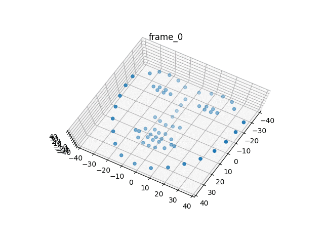

# 3D Face Reconstruction (CS231A final project)
An implementation of Bregler et al.'s factorization method for non-rigid structure for motion, combined with automated facial landmarking to create a 3D facial reconstruction pipeline

## Example results

